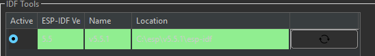
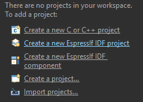
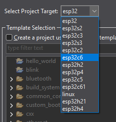
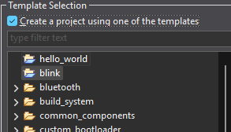
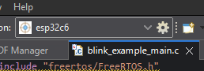
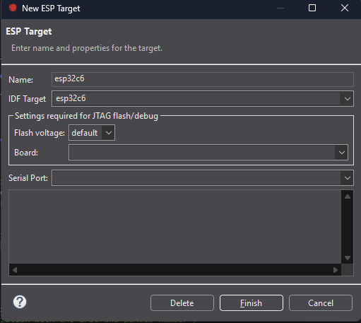

# Instalacion

## Descargas
- [Espressif IDE](https://docs.espressif.com/projects/espressif-ide/en/latest/downloads.html)

## Pasos
1. Ya en el link de [Espressif IDE](https://docs.espressif.com/projects/espressif-ide/en/latest/downloads.html), seleccionamos:
  

    
  

2. Se descomprime el archivo descargado y entrar a la ruta:

  > .\Downloads\Espressif-IDE-4.0.0-win32.win32.x86_64\artifacts\win32\Espressif-IDE

3. Ejecutar como admin:
   
  > espressif-ide.exe

4. Elegir una direccion de *workspace*:
  

    
  

5. Seleecionamos que si:
  

    
  

6. Creamos nueva instalacion y seleccionamos instalacion facil:
  

    
  

7. Nos aseguramos de seleccionar el firmware de IDF:
  

    
  

## Primer proyecto

1. Para la realizacion de un proyecto vamos a *Create a new Espressif IDF project*:
   
  

    
  

  
2. Seleccionamos nuestra placa a programar:

  

    
  

  
3. Y por simplicidad del proyecto usaremos los ejemplos que vienen por defecto, *blink* . Y aceptamos:

  

    
  

  
4. Ahora realizamos el *build* del proyecto.
   
5. Cargamos el script a la placa.
   
    1. Buscamos el engrane donde se encuentra la placa a programar (barra de herramientas superior):
       
        

          
        

        
    2. Declaramos el puerto donde se encuentra la placa.
       
        

          
        

      
