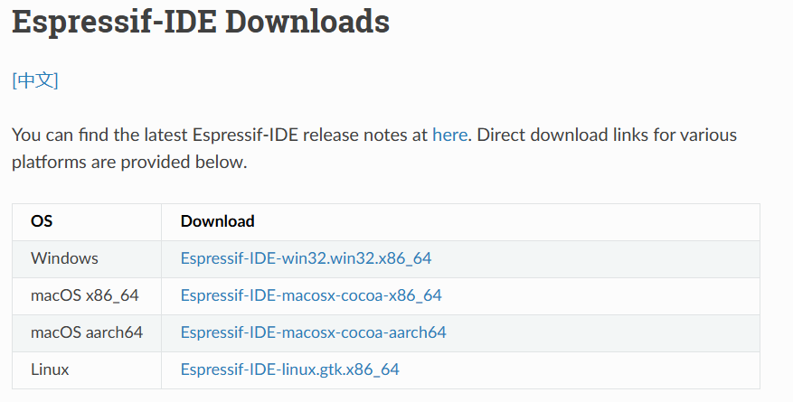
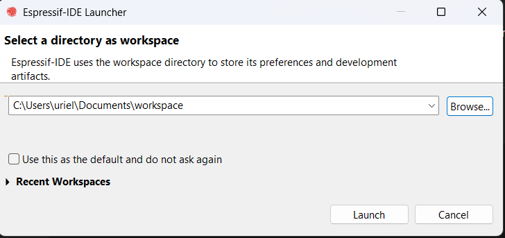
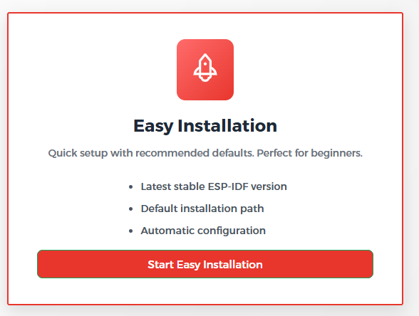

# Instalacion

## Descargas
- [Espressif IDE](https://docs.espressif.com/projects/espressif-ide/en/latest/downloads.html)

## Pasos
1. Ya en el link de [Espressif IDE](https://docs.espressif.com/projects/espressif-ide/en/latest/downloads.html), seleccionamos:

2. Se descomprime el archivo descargado y entrar a la ruta:

> .\Downloads\Espressif-IDE-4.0.0-win32.win32.x86_64\artifacts\win32\Espressif-IDE

3. Ejecutar como admin:

> espressif-ide.exe

4. Elegir una direccion de *workspace*:

5. Seleecionamos que si:

6. Creamos nueva instalacion y seleccionamos instalacion facil:

